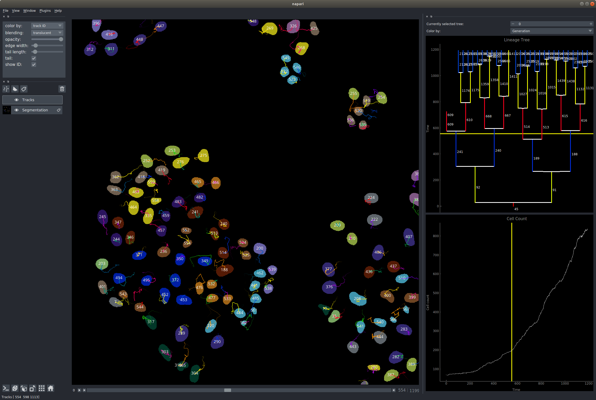

# Arboretum

### Overview

A dockable widget for [Napari](https://github.com/napari) for tracking cells using [btrack](https://github.com/quantumjot/BayesianTracker).

Features:
+ Custom `Track` layer for fast visualization of track data in napari
+ Integration with btrack to enable localization and cell tracking directly from napari
+ Lineage tree plot widget
+ Track count widget

[](http://lowe.cs.ucl.ac.uk/cellx.html)  
*Automated cell tracking and lineage tree reconstruction*.

---  

 :construction:  **WORK IN PROGRESS**  :construction:

 This is actively under development. There will be breaking changes on a daily basis until the first stable release. Use with caution!

 Read more about the scientific project here:
 http://lowe.cs.ucl.ac.uk/cellx.html

---

#### TODO:
+ [x] pip installer
+ [x] GUI for bTrack localization and tracking directly from Napari
+ [x] 3D track visualization (2D+t -> 3D, and 3D+t)
+ [x] Mouse interaction with tracks, click to select etc...
+ [x] Mouse cursor returns nearest track ID
+ [x] Store localizations in points layer, allowing interactive track editing
+ [x] Migrate to unified track data model
+ [x] Track coloring by track properties
+ [x] Visualize track merging or branching using a 'graph'
+ [x] Color tracks by properties
+ [x] Proper slicing when working in nd space
+ [x] Overhaul Export/Import with HDF5
+ [x] Tree plotting
+ [ ] PyPi package
+ [ ] Use integer labelled segmentation images as input
+ [ ] Remove redundant points/localizations storage of data


---

### Installation

We recommend that you first install Napari. Detailed instructions are here: https://github.com/napari/napari.

```sh
pip install napari[all]
```

then install arboretum:

```sh
git clone https://github.com/quantumjot/arboretum.git
cd arboretum
pip install -e .
```


### Testing the installation


Following installation, you can test the `Track` layer, as well as the btrack
package by running a built-in test. The test downloads some example data and a
tracker configuration file, tracks the objects and then renders the tracks with
napari:

```sh
cd tests
python test.py
```

### Example usage

**NOTE** You need to provide your own segmentation. There are lots of exciting
methods for this, depending on your data. Assuming you have a tif stack with
your segmentation, you can launch the tracking and visualization plugin like
this:

```python
import arboretum

from skimage import io
seg = io.imread('path/to/your/segmentation.tif')

# launch the viewer with plugin and automatically add image and segmentation
arboretum.run(segmentation=seg)
```

You can also add the raw image data when loading the plugin:
```python

img = io.imread('path/to/your/movie.tif')
arboretum.run(image=img, segmentation=seg)
```

At the moment there are a few buttons:
+ Load (load HDF created by btrack)
+ Save (export as HDF)
+ Configure (load a btrack configuration file)
+ Localize (find objects using the segmentation layer)
+ Track (track the localized objects)

### Configuration files for the tracker

An example config is available [here](https://github.com/quantumjot/arboretum/blob/master/tests/cell_config.json)


### Tracking methods and track optimization

btrack supports three different methods:
+ `EXACT` - (DEFAULT) exact calculation of Bayesian belief matrix, but can be slow on large datasets
+ `APPROXIMATE` - approximate calculation, faster, for use with large datasets.
+ `CUDA` - GPU implementation of the EXACT method (*in progress*)

For most cell datasets (<1000 cells) we recommend `EXACT`. If you have larger
datasets, we recommend `APPROXIMATE`.

If the tracking does not complete, and is stuck on the optimization step, this
means that your configuration is poorly suited to your data. Try turning off
optimization, followed by modifying the parameters of the config file.

This has an additional `max_search_radius` parameter, which sets the local
spatial search radius (isotropic, pixels) of the algorithm.

### State labelling

If your binary segmentation contains image labels (e.g. regions are labelled
with a specific state label), you can specify this when loading the segmentation
using the following flag:

```python
import arboretum

from skimage import io
img = io.imread('path/to/your/movie.tif')
seg = io.imread('path/to/your/segmentation_with_labels.tif')

# launch the viewer with plugin  
arboretum.run(image=img, segmentation=seg, use_labels=True)
```

You can improve the quality of the tracking by providing cell 'states' along
with the segmentation. The plugin uses the following labels for the segmentation:

1. Interphase / Unlabelled (DEFAULT)
2. Pro(meta)phase
3. Metaphase / Pre-division
4. Anaphase / Post-division
5. Apoptosis / Dead

Change the labels on the segmentation using the labels tool, or provide a
pre-labelled segmentation.
