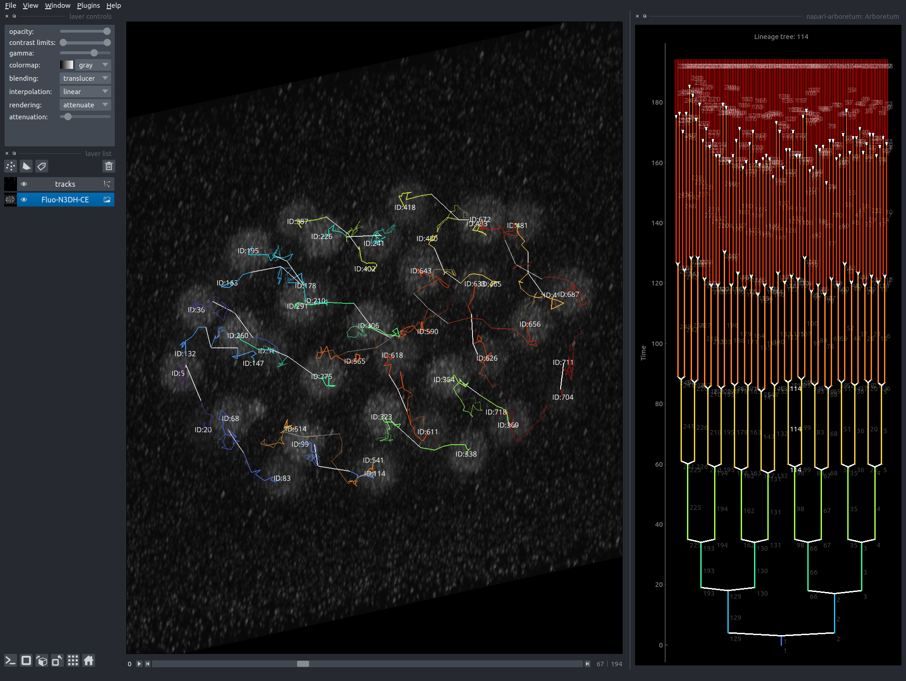

 <!--[](https://pepy.tech/project/napari-arboretum)-->
[](https://github.com/quantumjot/napari-arboretum/raw/master/LICENSE)
[](https://pypi.org/project/napari-arboretum)
[](https://python.org)
[](https://github.com/quantumjot/arboretum/actions)
[](https://codecov.io/gh/quantumjot/arboretum)

# Arboretum


### Overview

A dockable widget for [Napari](https://github.com/napari) for visualizing cell lineage trees.


Features:
+ Lineage tree plot widget
+ Integration with [btrack](https://github.com/quantumjot/BayesianTracker)

This project has changed considerably. The `Tracks` layer, originally developed for this plugin, is now an official layer type in napari. Read the napari documentation here:  
 https://napari.org/api/stable/napari.layers.Tracks.html#napari.layers.Tracks


To view the legacy version of this plugin, visit the legacy branch:  
https://github.com/quantumjot/arboretum/tree/v1-legacy

[]()  
*Automated cell tracking and lineage tree reconstruction*.

---  


### Installation

We recommend that you first install napari. Detailed instructions are here: https://github.com/napari/napari.

```sh
pip install 'napari[all]'
```

You can install arboretum directly from napari (using the `Plugins > Install/Uninstall Packages(s)...` menu) and searching for `napari-arboretum`.

Alternatively, you can install directly from source:

```sh
git clone https://github.com/quantumjot/arboretum.git
cd arboretum
pip install -e .
```

### Usage

Once installed, Arboretum will be visible in the `Plugins > Add Dock Widget > napari-arboretum` menu in napari.  To visualize a lineage tree, click on one of the tracks in a napari `Tracks` layer.

You can use *btrack* to generate tracks from your image data. See the example notebook here:  
https://github.com/quantumjot/BayesianTracker/blob/master/examples/segmentation_to_btrack_to_napari.ipynb


---

#### TODO:
+ [ ] Highlight cells in the viewer from the lineage tree view
+ [ ] Visualize merges
+ [ ] Color trees by properties


---
